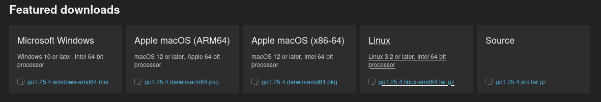

# Изучение Go. Ч.1: установка, go toolchain, модули, пакеты и версии.

## Введение

Привет всем заглянувшим.

В этом видео я хочу поделиться с вами своим опытом в освоении Go.  
Go для меня — новый язык.  
То есть в этот плейлист попадут ролики, в которых я просто **запечатлел** свой путь в освоении Go.

В этом процессе первым делом я стараюсь составить общую картину технологии.  
Мне не нравится учить «сферический язык в вакууме», начиная с синтаксиса, или идти путём чистой практики без какой-либо систематизации знаний по этому вопросу.  
Хотя я и не считаю это плохим методом — просто он не подходит мне.

Мне нравится, когда я имею представление о законах этого мира,  
а затем изучаю его прикладное применение, углубляясь в нюансы синтаксиса и принятые в индустрии паттерны.

То есть сначала я формирую общую картину, а потом рассматриваю язык как набор правил по составлению кода.

Если подобный формат и сама тема вам интересны, то не забывайте ставить лайк и подписываться на канал.

А теперь к делу.

Go был разработан в 2007 году в недрах компании Google,  
а в 2012 году вышла его первая публичная версия.

Основной целью разработчиков Go было создание языка, который сочетает:

- простоту и читаемость кода;
- высокую производительность и эффективность;
- встроенную поддержку конкурентности;
- интегрированный инструментальный набор (toolchain), обеспечивающий единообразную работу с компиляцией, зависимостями, форматированием и тестированием.

## Установка Go

Ну что же… давайте установим Go и посмотрим, что мы получаем в распоряжение.  
Для этого перейдём на [официальный сайт](https://go.dev/dl/).

Напомню, что все ссылки, примеры команд или кода будут в текстовой версии видео на GitHub.  
Ссылка будет в закреплённом комментарии под видео.

И скачаем пакет для нашей операционной системы.

<p align="center">
  
</p>

У меня Linux, и так как я провожу демонстрацию на VirtualBox, скопирую ссылку на архив и скачаю его вручную через терминал:

```bash
wget https://go.dev/dl/go1.25.5.linux-amd64.tar.gz
```
И распакую его в директорию `/usr/local`:

```bash
sudo tar -C /usr/local -xzf go1.25.5.linux-amd64.tar.gz
```
А потом добавлю путь к директории с бинарником go в переменную `PATH`.  
Для этого добавляем в файл `micro ~/.bashrc`  
команду `export`.

```bash
export PATH=$PATH:/usr/local/go/bin
```

Обновим сессию оболочки:
```bash
su $USER
```

И запустим команду:
```bash
go version
```
Отлично! Go установлен.

Если вы будете ставить на Windows, то там будет wizard-установщик, и по классике — далее, далее.

## Знакомство

Так как теперь у нас есть возможность запускать бинарник `go`,  
мне хотелось бы внести некоторую ясность в этот вопрос.

Многие называют этот бинарник компилятором,  
но это не совсем точно.

### Go Toolchain

Если выразиться более корректно, то бинарник `go` — это командная оболочка (интерфейс) ко всему набору инструментов Go-разработчика (или `Go Toolchain`).

В этом проявляется философия языка: весь основной инструментарий разработчика предоставляется через один интерфейс и доступен из коробки.

Если, например, посмотреть на мир PHP-разработчика, то там есть:  
- интерпретатор;  
- отдельный менеджер пакетов `composer`;  
- отдельные пакеты для тестирования и анализа кода, требующие наличия composer и имеющие свои собственные зависимости.

То есть `PHP-toolchain` не имеет общего интерфейса управления и разрабатывается разными командами.

Так что такой подход, принятый в Go, можно смело причислить к достоинствам.

Давайте попробуем немного структурировать Go Toolchain.  
Так сказать, разложим все инструменты по полочкам.

Для примера мы можем построить некую иерархию команд в Go.  
Давайте вставим её в терминал и посмотрим:

```bash
go  
├─ Основные операции с кодом  
│  ├─ build  
│  ├─ run  
│  ├─ test  
│  ├─ install  
│  ├─ list  
│  ├─ clean  
│  └─ doc  
│  
├─ Работа с модулями  
│  ├─ mod  
│  └─ get  
│  
├─ Форматирование и генерация  
│  ├─ fmt  
│  └─ generate  
│  
├─ Анализ и качество  
│  ├─ vet  
│  └─ fix  
│  
├─ Инструменты и отладка  
│  ├─ tool  
│  └─ telemetry  
│  
└─ Служебные команды  
   ├─ bug  
   ├─ env  
   ├─ version  
   └─ work
```

Тут мы видим, что после вызова самого бинарника go мы можем передавать ему разные команды.  
Для себя я поделил их на следующие группы:  
Основные операции с кодом,  
работа с модулями,  
форматирование и генерация,  
анализ и качество,  
инструменты и отладка,  
служебные команды.

Иными словами, у нас есть слой оболочки или интерфейса, выраженный в наборе команд, и есть реальные утилиты, которые вызываются под капотом при выполнении команд оболочки.  
К примеру, программисту предоставляется команда интерфейса `go build -o result_file_name`, а под капотом будут вызваны реальные утилиты, которые расположены по пути `ls -la /usr/local/go/pkg/tool/linux_amd64/`. Например, это:

- compile  
- link  
- asm  
- ...

Эти утилиты входят в состав архива, который предоставляет официальный сайт.  
Я говорю об архиве, который я скачал для установки Go в начале видео.

То есть основная суть всего вышесказанного означает, что в архиве есть набор основных инструментов и есть бинарник go, который является интерфейсом к ним.

Чтобы посмотреть все команды, доступные через интерфейс `go`, используется:

```go
go help
```

А чтобы посмотреть описание отдельной команды, например `build`, можно выполнить:
```go
go help build
```

Или, как вариант, с описаниями команд можно познакомиться на [официальном сайте](https://pkg.go.dev/cmd/go).

В общем, я думаю, что базовая ясность в этом вопросе достигнута, и можно идти дальше.

### Основные сущности проекта

Следующим шагом я решил посмотреть на Go с точки зрения усреднённого абстрактного проекта.

И в этом процессе у меня сформировалась такая картина:

В роли некоторой целой единицы выступил модуль.

И поскольку сейчас будет теоретическая часть, я пока перейду к слайдам.

#### О модулях

(Слайд №1)  
Модуль — это единица версионирования, сборки и управления зависимостями.

А теперь давайте попробуем вникнуть в суть этого определения.

Сначала теоретически, а потом и практически.
 
(Слайд №2)  
В общем, это директория с файлом go.mod, в котором хранится метаинформация модуля (например, его имя и зависимости).

Модуль включает в себя все поддиректории от файла go.mod (до первого встреченного другого файла go.mod).

По факту проект может состоять из более чем одного модуля (в этом случае проект будет содержать несколько директорий с отдельными файлами go.mod), но более распространённый вариант — это один проект = один модуль.  
Хотя при разработке публичного пакета, если у него появляется вторая версия, может понадобиться создать новую директорию с файлом go.mod. Мы это увидим на практике.

Модуль обязательно имеет имя.  
Оно формируется по следующему условию:

(Слайд №3)  
- Если модуль публикуется для внешнего использования → нужен доступный для go get URL (например, `GitHub/Bitbucket/GitLab`-подобный путь или что-то типа: `internal.company.local/myservice`).

(Слайд №4)  
- А вот если модуль локальный → любое имя.

То есть на старте мы должны ответить на вопрос: «Будет ли другой Go-проект когда-либо импортировать этот модуль?»

Если:

❌ Нет → можно писать любое имя (crm, myapp, service)  
✔️ Да → обязательно использовать URL-путь (типа: github.com/user/service)

А теперь затронем понятие «приложение». Модуль может включать в себя одно или несколько приложений.

#### О приложениях

Приложения, в свою очередь, состоят из пакетов.  
Как минимум один — это main, или main + набор пакетов нашего модуля или сторонних.  
Приложения становятся отдельными бинарниками.  
То есть отдельный бинарник = отдельному приложению проекта.

Давайте немного визуализируем это:  
(Слайд №5)
.
├── go.mod  
├── go.sum  
├── cmd/  
│   ├── api/      (приложение 1)  
│   └── worker/   (приложение 2)  
└── internal/

Тут мы видим некую директорию, а в ней файл `go.mod`.  
Это модуль.  
В нём есть директория `cmd`, в которой лежат два приложения (api и worker).  
Каждое из этих приложений будет компилироваться в отдельный бинарник.  
То есть каждый из них является отдельным пакетом `main` со своей точкой старта в виде функции `main`.

#### О импорте и его правилах

А теперь поговорим об импорте пакетов и правилах, по которым он работает.

##### О импорте публичных пакетов

(Слайд №6)  
Если речь идёт о внешних публичных пакетах, то импортируем мы именно пакет,  
но в качестве зависимости выступит модуль.  
То есть ключевым моментом, который нужно понять, является то, что импорт всегда работает на уровне пакетов,  
а скачивание — на уровне модулей.

(Слайд №7)  
Это значит, что когда мы пишем в коде:
```go
import "github.com/user/project/utils"
```

(Слайд №8)
А после этого выполняем команду:
```bash
go mod tidy
```
То этим мы говорим, что хотим импортировать пакет `utils`, но по факту Go установит как зависимость и скачает весь модуль `github.com/user/project`.

##### О импорте локальных пакетов

Напомню, это был взгляд на работу с импортом в отношении публичных внешних пакетов.

Если же нам нужно импортировать свои пакеты из своего локального проекта, то импорт просто производится через имя модуля.

(Слайд №9)  
Например, если у нас есть модуль:
```go
module crm
```
То импорт какого-то внутреннего пакета производится так:
```go
import "crm/service"
```

##### О версиях и псевдо-версиях 

А теперь поговорим о версиях.  
При импорте публичных пакетов мы часто сталкиваемся с тем, что их существует несколько версий.  
И нужно понимать, по каким правилам будет происходить эта работа.  
Это нужно как минимум для того, чтобы импортировать внешние пакеты и либо самостоятельно указывать нужную нам версию, либо понимать, какая подтянется по умолчанию.  
Ну и, естественно, это нужно для тех случаев, когда мы сами делаем публичный проект и планируем, что у него будут версии.  

(Слайд №10)  
Так вот, когда мы НЕ указываем, какая версия нам нужна (то есть после ключевого слова import идёт github.com/user/project/utils, но в пути нет `v2` или `v3`), то `go mod tidy` поступит одним из следующих вариантов:

(Слайд №11)  
1) Если у импортируемого модуля существует v1 → скачивается последняя доступная версия из диапазона v1.x.x  
2) Если v1 нет, но есть v0 → скачивается последняя версия из диапазона v0.x.x  
3) Если нет v0 и v1 → скачивается псевдоверсия  

Псевдоверсия в конкретно этом примере будет снимком последнего коммита дефолтной ветки (обычно main или master), помеченным датой и хешем в качестве версии.

(Слайд №12)  
То есть сформированная зависимость будет иметь вид:
```go
require github.com/user/proj v0.0.0-<YYYYMMDDHHMMSS>-<commit_hash>
```
Это: имя модуля, нулевая версия, дата и хеш коммита.

(Слайд №13)  
В качестве дополнения скажу, что псевдоверсия может появиться даже тогда, когда у внешнего модуля уже есть версии, но при выполнении `go get` был указан не тег версии, а, например, имя ветки или коммит.
```go
go get github.com/user/project@dev
```

В этом случае псевдоверсия будет указывать на последний коммит ветки dev. Мы также увидим это на практике.

Итак, если вернуться к нашему правилу из трёх пунктов и показать это чуть более конкретно, получится такая картина.

(Слайд №14)  
Допустим, у внешнего модуля есть следующий список версий:
- 0.1.14
- 0.5.99
- 0.99.99
- 1.1.12
- 1.5.0
- 1.9.99
- 2.1.22

То при указании импорта без версии типа v2 скачана и установлена как зависимость будет версия 1.9.99,  
а именно самая последняя в пределах первой.

Но что тогда делать, если мы работаем с модулем, у которого много версий, и нам нужна какая-то конкретная — например, 2.2.33?  
(Слайд №15)  
В этом случае нужно сначала выполнить go get в следующем формате:
```bash
go get github.com/user/proj/v2@v2.2.33
```

(Слайд №16)  
Это приведёт к появлению зависимости в файле go.mod вида:
```bash
require github.com/user/proj/v2 v2.2.33
```
 
(Слайд №17)
Далее мы можем — просто использовать импорт вида:
```go
import "github.com/user/proj/v2/utils"
```

Тут я немного остановлюсь и обращу ваше внимание, что мы сейчас ввели  
новый способ по управлению зависимостями.  
Это `go get`.

То есть вместо последовательности, описанной в начале разговора об импорте и его правилах:  
где сначала импорт пакета в коде,  
(Слайд №18)  
можно пойти другим путём. Сначала получить модуль, выполнив:
```bash
go get github.com/user/project
```

Это скачает модуль по вышеописанным правилам из трёх пунктов.

(Слайд №19)  
И добавит зависимость в файл go.mod типа одной из представленных на слайде:
```bash
require github.com/user/project v1.X.X
```
или 
```bash
require github.com/user/project v0.X.X
```
или
```go
require github.com/user/proj v0.0.0-<YYYYMMDDHHMMSS>-<commit_hash>
```

(Слайд №20)  
А после этого мы уже можем импортировать в коде пакет из полученного ранее модуля:
```go
import "github.com/user/project/utils" [можно не произносить]
```
То есть это то же самое, но пакеты ставим мы сами, а не команда `go mod tidy`, которая просто ориентируется на имеющиеся импорты в коде.

Тут главное уловить, что у этих двух подходов правила по работе с импортом совпадают.

Последнее, что добавлю, — это то, что модули при выполнении:
```bash
go get
go mod tidy
```

Будут расположены по пути, который хранится в переменной GOMODCACHE.  
В блоке с практикой мы это увидим.

Возможно, в будущем я ещё покопаюсь в этой теме, так как есть ещё ряд любопытных вопросов, но я сознательно не стал в них углубляться.  
Кажется, что они могут немного подождать.  
Так что перейдём к практической части.

### Практика

Но практику эту я начну с резюме и вытекающей из него структуры практики.

Итак, резюмируем:

1. Мы установили Go.

2. Поняли, что бинарь go — это интерфейс над набором утилит, и всё это идёт из коробки.

3. Посмотрели на Go с точки зрения типичного проекта.  
   Из этого стало понятно, что:  
   - у нас есть модуль (по сути — директория с файлом go.mod);  
   - в этом модуле может быть одно или более приложений.  
     Каждое приложение — это самостоятельный пакет main, из которого получается самостоятельный бинарник.

4. Поняли, что у модуля должно быть имя и есть правила его формирования.

5. Я затронул импорт.  
   На первый взгляд, этот переход немного резковатый.  
   Как будто бы выбивается из контекста.  
   Но дело в том, что, пытаясь разобраться в логике работы пакетов и модулей,  
   я понял, что разбираться тут нужно именно комплексно.

   У нас есть модуль, в нём приложение (это пакет main), пакет main может импортировать другие пакеты, те, в свою очередь, тоже могут импортировать другие пакеты.

   Пакеты, предназначенные для импорта, могут быть частью нашего модуля и лежать в директориях типа internal или pkg, а могут и тянуться по сети.

   Также нужно понимать, что, когда мы импортируем внешний пакет, Go при этом скачает на диск весь его модуль,  
   а именно — в директорию, указанную в GOMODCACHE. Но на этапе компиляции из этого модуля подтянется только указанный пакет.

   Так вот, ко всему этому нужно добавить то, что пакеты могут иметь версии.  
   А это порождает определённые правила, по которым работает импорт внешних и локальных пакетов, и определяет, как будет устроен наш модуль, если мы ведём разработку, например, библиотеки, у которой будут версии.

   Вот так я и пришёл к тому, что нужно именно такое понимание.

А теперь давайте структурируем практику.

Для визуализации вставлю заголовки блоков в терминал:  
Блок 1. Один проект = один модуль + несколько приложений  
Блок 2. Импорт на уровне пакетов, скачивание на уровне модулей  
Блок 3. Как Go выбирает версию, если мы её явно не указываем  
Блок 4. Псевдоверсии: при импорте ветки dev  
Блок 5. Установка конкретной версии  

Первым блоком мы посмотрим, как один проект равен одному модулю и в нём есть несколько приложений.  
Вторым блоком будет демонстрация того, что в коде мы импортируем пакет, а подтянется весь модуль.  
Третьим блоком мы посмотрим, как Go ведёт себя, когда мы импортируем пакеты, не указывая нужную нам версию, и затронем дополнительное понятие псевдоверсии.  
Четвёртым блоком, в качестве дополнения, посмотрим, как могут появиться псевдоверсии, если импортировать не по тегу, а по ветке.  
В пятом блоке посмотрим, как импортировать конкретную версию из перечня имеющихся.

Хорошо, а теперь перейдём к реализации.

#### Блок 1 Один проект = один модуль + несколько приложений

Нашей первой целью будет почувствовать модуль как единицу проекта и отдельные бинарники как приложения.  
Какой-то логики в функционале проекта не будет.  
Только вызовы функций-пустышек, чтобы увидеть, что схема работает так, как мы ожидаем.

У нас сейчас есть только пустая директория first-contact.  
Это условно директория нашего проекта.  
И для создания структуры проекта я выполню скрипт на bash.

По сути, я просто заскриптовал то, что мог бы делать руками в течение объяснения.  
То есть я пошёл немного иначе.  
Я буду показывать скрипт или его фрагмент и рассказывать, что он сделает.  
Потом — его запуск и анализ результатов.

В общем, давайте создадим файл `block1.bash`  
и вставим туда код.

Если посмотреть на код, то тут я:
```bash
#инициализирую модуль обычным локальным именем
go mod init first-contact
#создаю набор директорий
mkdir -p cmd/api
mkdir -p cmd/worker
mkdir -p internal/service
```

Тут сразу сделаю ремарку. То, что я сейчас делаю, — это НЕ канонический паттерн по архитектуре проекта на Go.  
Хотя такой существует. Но думаю, что его стоит разбирать вообще отдельной темой.  
Я просто беру его фрагменты, подходящие под мою демонстрацию.

Например, директория cmd, в том виде, как я это создаю в скрипте, — это принятый в сообществе паттерн, но не обязательный.  
А вот директория internal имеет специальный функционал. Пакеты, размещённые в ней, доступны только внутри нашего модуля (точнее — внутри родительского каталога и его подкаталогов), но закрыты для внешнего мира.  
Имя директории internal является зарезервированным механизмом Go и имеет специальное значение.

```bash
#далее создаем файл сервиса и записываем туда код
cat << 'EOF' > internal/service/service.go
package service

import "fmt"

func SayHello(name string) {
    fmt.Printf("Hello, %s!\n", name)
}
EOF
```

Мы тут видим, что главный файл пакета называется так же, как и директория пакета.

А в самом коде видим имя пакета, импорт пакета из стандартной библиотеки Go и функцию.  
А вот функции `main` тут нет.

Следующим шагом создаём файл cmd/api/main.go и запишем туда код:
```bash
cat << 'EOF' > cmd/api/main.go
package main

import (
    "first-contact/internal/service"
)

func main() {
    service.SayHello("from API")
}
EOF
```

Тут мы создаём пакет main для приложения api и импортируем пакет service из нашего модуля.  
В теле функции main просто вызываем функцию из пакета service.

После этого создаём второе приложение cmd/worker/main.go и записываем туда код:
```bash
cat << 'EOF' > cmd/worker/main.go
package main

import (
    "first-contact/internal/service"
)

func main() {
    service.SayHello("from Worker")
}
EOF
```

В коде мы создаём пакет main для приложения worker и импортируем пакет service из нашего модуля.  
В теле функции main также вызываем функцию из пакета service.

Следующим шагом мы выполняем сборку этих приложений.  
То есть мы сначала набросали структуру, а потом сразу билдим это в бинарники.  
Для этого выполняется:
```bash
mkdir -p bin
go build -o bin/api ./cmd/api
go build -o bin/worker ./cmd/worker
```

Давайте запустим этот скрипт.  
Выполним в терминале `bash block1.bash`.  
После его выполнения можно увидеть, что создана вся описанная структура.

Тут есть две директории с точкой входа в код приложения (это api и worker) и один внутренний пакет service.  
И есть файл go.mod.

Если также посмотреть в директорию bin, то увидим, что у нас появились два бинарника.  
Каждый — это отдельное приложение в финальном виде.

И мы можем запустить в терминале эти приложения, например, просто выполнив `./bin/api`.  
В результате увидим строку "Hello, from API!", а значит, всё корректно отработало.

То есть цель, поставленная перед первым блоком, достигнута.  
Идём дальше.

Финальный вид скрипта:
```bash
#!/usr/bin/env bash

set -e

# 1. Initialize the module
go mod init first-contact

# 2. Create directories
mkdir -p cmd/api
mkdir -p cmd/worker
mkdir -p internal/service

# 3. Create the file internal/service/service.go
cat << 'EOF' > internal/service/service.go
package service

import "fmt"

func SayHello(name string) {
    fmt.Printf("Hello, %s!\n", name)
}
EOF

# 4. Create the file cmd/api/main.go
cat << 'EOF' > cmd/api/main.go
package main

import (
    "first-contact/internal/service"
)

func main() {
    service.SayHello("from API")
}
EOF

# 5. Create the file cmd/worker/main.go
cat << 'EOF' > cmd/worker/main.go
package main

import (
    "first-contact/internal/service"
)

func main() {
    service.SayHello("from Worker")
}
EOF

# 6. Build the applications
mkdir -p bin
go build -o bin/api ./cmd/api
go build -o bin/worker ./cmd/worker

echo "Done! The files are created and compiled."
```

#### Блок 2 Импорт на уровне пакетов, скачивание на уровне модулей

Целью следующего блока будет показать, что в коде мы импортируем пакет, а скачивается весь модуль.

Для этого в уже созданном модуле (например, в приложении api) нужно добавить простой внешний импорт.  
Давайте откроем файл first-contact/cmd/api/main.go и добавим импорт:
```go
"github.com/google/uuid"
```

И выполним после этого:
```bash
go mod tidy
```

Это приведёт к тому, что в файле go.mod появится зависимость:
```go
require github.com/google/uuid v1.6.0
```

Но, как мы уже знаем из теоретического блока, чтобы посмотреть, где физически лежат скачанные по зависимости модули,  
можно выполнить:
```bash
go env GOMODCACHE
```

В моем случае это `/home/vysmv/go/pkg/mod`

А чтобы точно узнать, где физически лежит модуль, выполним следующую команду:
```bash
go list -m -json github.com/google/uuid
```
И возьмём путь из поля Dir и выполним ls:
```bash
ls -la /home/vysmv/go/pkg/mod/github.com/google/uuid@v1.6.0
```
То увидим все файлы модуля.

То есть цель блока достигнута: мы увидели, что импортируем мы в коде пакет, но скачивается весь модуль.  
Значит, можем идти дальше.

#### Блок 3. Как Go выбирает версию, если мы её явно не указываем в импорте

Тут нашей целью будет продемонстрировать правила выбора версии (v1 → v0 → псевдоверсия).

Для начала рядом с нашим текущим модулем я создам директорию dvm, то есть «демо версии модуля», и открою её в VS Code:
```bash
mkdir ~/dvm && code ~/dvm
```

Теперь у нас есть наш локально разрабатываемый модуль first-contact и демо-версия публичного модуля dvm.  
Его пакет мы и будем импортировать в наших тестах.

В этом блоке я тоже пойду путём выполнения скрипта,  
но чуть более хитро.

Демонстрация этого блока состоит из шести шагов, и скрипт будет спрашивать у нас, хотим ли мы продолжить следующий шаг.  
То есть запустили и разобрали первый шаг и нажимаем в терминале `y`, чтобы продолжить, и выполняем следующий шаг и т. д.

Давайте создадим файл `block3.bash`  
и вставим туда код.

Логика тут будет такая:  
у нас есть функция ask, которая проверяет, хочу ли я продолжать.

Далее функция local_clear, но о ней позже.

Есть код каждого шага.

И если проскроллить вниз, то там будет вызов каждого шага через вызов функции ask.

А теперь перейдём к разбору bash-скрипта, запуску и последующему анализу результата после каждого шага.

**Первый шаг: Создадим структуру модуля и запушим ее на Github.**

Первым делом я инициализирую модуль:
```bash
go mod init github.com/vysmv/dvm
```

Далее создадим пакет utils, а в нём файл utils.go и вставим туда код:
```bash
mkdir -p ~/dvm/utils
cat <<EOF > ~/dvm/utils/utils.go
package utils

import "fmt"

func Hello() {
    fmt.Println("Hello from utils!")
}
EOF
```

В коде мы просто объявляем пакет utils,  
импортируем fmt и объявляем функцию Hello.

Так как у нас будут примеры с версиями, то я создал для проекта dvm репозиторий:

https://github.com/vysmv/dvm

Поэтому выполню следующие команды для инициализации репозитория и запушу текущую структуру:
```bash
git init
git add .
git commit -m "first commit"
git branch -M main
git remote add origin git@personal_gh:vysmv/dvm.git
git push -u origin main
```

Тут все команды стандартные, кроме строки `git remote add origin git@personal_gh:vysmv/dvm.git`.  
Стандартно вместо `personal_gh` идёт `github.com`.  
Это потому, что я настраивал себе работу с GitHub на два аккаунта и специфически конфигурировал процесс.  
Если вам хотелось бы посмотреть, как настраивал я, то ссылку на это видео добавлю в закреплённый комментарий.  
И так как это не имеет отношения к основной теме, то идём дальше.

Запускаем скрипт и вводим пароль (два раза).

Давайте посмотрим, что получилось.  
У нас есть модуль dvm с одним пакетом utils, и он запушен на GitHub.  
Давайте это проверим, обновив страницу репозитория https://github.com/vysmv/dvm.  
А если посмотреть файл go.mod, то имя модуля будет указано как URL-путь.  
То есть он может быть доступен извне.

**Второй шаг: имортируем пакет когда у внешнего dvm нет версий**

Тут я добавлю импорт в приложение api модуля first-contact.  
Для этого перезаписываю файл ~/first-contact/cmd/api/main.go на:
```bash 
 cat <<EOF > ~/first-contact/cmd/api/main.go
package main

import (
    "first-contact/internal/service"
    "github.com/vysmv/dvm/utils" ####new line
)

func main() {
    service.SayHello("from API")
}
EOF
```

По сути, просто добавляю новую строку с импортом нашего пакета utils из модуля dvm.

И после этого выполню следующий набор команд:
```bash
export GOPROXY=direct
rm -rf ~/go/pkg/mod/cache/download/github.com/vysmv/dvm
cd ~/first-contact
go clean -modcache
export GOPRIVATE=github.com/vysmv/*
go mod tidy
```

Тут я устанавливаю значение переменной GOPROXY=direct, чтобы скачивание модулей происходило напрямую с GitHub, а не через прокси.  
И удаляю всё из этой директории `~/go/pkg/mod/cache/download/github.com/vysmv/dvm`, так как до записи я экспериментировал и хочу удалить артефакты.  
`go clean -modcache` я выполняю с той же целью.

А вот переменная GOPRIVATE со значением `github.com/vysmv/*` нужна для того, чтобы не возникало конфликтов с хэш-суммами версий на время экспериментов.  
Так как вы можете несколько раз во время тестов создавать репозиторий и набор одних и тех же тегов, это будет приводить к конфликтам без этого экспорта.  
Выполнение экспортов в терминале меняет параметры только на период сессии терминала  
и ничего вам не сломает в будущем.  
Так что на период тестов — приемлемое решение.

И в завершение вызываю `go mod tidy`, чтобы подтянуть зависимость, которую мы ранее указали в импорте.

Отлично, теперь можем ввести `y`, чтобы запустить выполнение второго шага.

После этого мы должны увидеть, что в файле go.mod модуля first-contact появится зависимость с псевдоверсией типа:  
```go
require github.com/vysmv/dvm v0.0.0-20251206092652-0f827210d4d2
```

То есть мы подтвердили, что если у внешнего модуля нет версий типа v1 или v2, то мы получим псевдоверсию.

Хорошо, с этим всё, и можем идти дальше, а дальше у нас…

**Третий шаг: имортируем пакет когда у модуля есть версия из диапазона нулевых**

Для этого мы обновим dvm до версии 0.1.12 и выполним повторный импорт пакета из dvm в модуль first-contact.

Но сначала, перед каждым новым действием, я буду запускать функцию `local_clear`.  
При первом осмотре скрипта я сказал, что упомяну о ней позже.  
Давайте на неё посмотрим.

Это просто копирование строки с импортом в файле main.go в директории first-contact/cmd/api/, а потом её удаление, выполнение `go mod tidy` и возвращение строки с зависимостью назад.  
Нужно это, чтобы перед каждым новым запуском у нас удалялась прошлая зависимость.  
То есть происходила очистка. Иначе из-за того, что она уже установлена, некоторые тесты не отработают так, как мы ожидаем, так как импорт и зависимость уже имеются.  
Дальше я не буду объяснять значение этой функции, а просто вызывать `local_clear`.

Далее… добавим новую функцию (просто перезапишем весь файл) dvm/utils/utils.go:
```bash

 cat <<EOF > ~/dvm/utils/utils.go
package utils

import "fmt"

func Hello() {
    fmt.Println("Hello from utils!")
}

func NewFuncV0() {                      ### [new function]
    fmt.Println("Hello from utils!")
}
EOF
```
По сути, просто добавим функцию NewFuncV0.

А после этого выполним команды, которые создадут новый тег и запушат изменения:
```bash
cd ~/dvm
git add .
git commit -m "added new func for V0"
git push
git tag v0.1.12
git push --tags
```

Далее выполним `go mod tidy` в модуле first-contact.
```bash
cd ~/first-contact
go mod tidy
```

Хорошо, давайте выполним третий шаг и введём ещё раз `y`. А после введём три раза пароль.

Если теперь посмотрим на файл go.mod у модуля first-contact,  
там уже будет версия 0.1.12:
```go
require github.com/vysmv/dvm v0.1.12
```

В общем, наши ожидания подтвердились, и можно идти дальше.

**Четвёртый шаг: импортируем пакет, когда у модуля есть версия из диапазона первых**

Следующим шагом будет четвёртый, где мы импортируем пакет, когда у модуля есть версия из диапазона первых.  
Давайте добавим нашему модулю dvm версию 1.0.0.

Для этого выполним ещё одну перезапись файла utils.go в директории /dvm/utils:

```bash
cat <<EOF > ~/dvm/utils/utils.go
package utils

import "fmt"

func Hello() {
    fmt.Println("Hello from utils!")
}

func NewFuncV0() {
    fmt.Println("Hello from utils!")
}

func NewFuncV1() { #NEW FUNC
    fmt.Println("Hello from utils!")
}
EOF
```

Где, по сути, ещё раз добавим функцию. На этот раз под именем NewFuncV1.

А после сделаем commit и запушим изменения.  
Потом создадим тег и запушим его.
```bash
# 2. git commit + tag v1.0.0
cd ~/dvm
git add .
git commit -m "added new func for V1"
git push
git tag v1.0.0
git push --tags
```

После чего выполним:
```bash
local_clear

# 3. run go mod tidy
cd ~/first-contact
go mod tidy
```
Давайте запустим четвёртый шаг (тут нужно ввести несколько раз пароль) и посмотрим на результат.

В файле go.mod модуля first-contact мы увидим зависимость версии 1.0.0.
```go
require github.com/vysmv/dvm v1.0.0
```

Хорошо, этот тест тоже успешный, то есть прошёл в соответствии с ожиданием.  
А значит, идём дальше.

**Пятый шаг: создаём вторую версию dvm и импортируем вторую версию**

Дальше нас ждёт пятый шаг.  
Тут создаём вторую версию dvm и импортируем вторую версию в first-contact.  
Первым делом мы выполняем `local_clear`:
```bash
local_clear
```

И далее создаём новую версию, а именно v2, для модуля dvm.  
Для этого в корне модуля создаём директорию v2.  
В ней инициализируем модуль с новым именем.  
И записываем туда код прошлой версии пакета, но меняем API пакета.  
То есть изменяем имя одной функции.

```bash
# 1–5. create v2 module and utils.go
    mkdir -p ~/dvm/v2/utils

    cd ~/dvm/v2
    go mod init github.com/vysmv/dvm/v2

    cat <<EOF > ~/dvm/v2/utils/utils.go
package utils

import "fmt"

func HelloNewAPI() { #NEW API
    fmt.Println("Hello from utils!")
}

func NewFuncV0() {
    fmt.Println("Hello from utils!")
}

func NewFuncV1() {  
    fmt.Println("Hello from utils!")
}
EOF
```
То есть меняем имя функции с Hello на HelloNewAPI.

А после этого коммитим, пушим изменения и ставим тег v2 на корень репозитория:
```bash
cd ~/dvm
git add .
git commit -m "added v2"
git push
git tag v2.0.0
git push --tags
```

После этого обновляем файл ~/first-contact/cmd/api/main.go:
```bash
cat <<EOF > ~/first-contact/cmd/api/main.go
package main

import (
    "first-contact/internal/service"
    "github.com/vysmv/dvm/v2/utils" #NEW IMPORT
)

func main() {
    service.SayHello("from API")
}
EOF
``` 

То есть устанавливаем новый импорт github.com/vysmv/dvm/v2/utils.

И в завершение выполняем:
```bash
cd ~/first-contact
go mod tidy
```

И если мы запустим этот шаг… (тут, как обычно, нужно вводить пароли), то увидим, что в go.mod модуля first-contact появилась зависимость на вторую версию.
```go
require github.com/vysmv/dvm/v2 v2.0.0
```
То есть мы выполнили задачу этого шага и увидели, как создать вторую версию и импортировали её в проект first-contact.  
А значит, можем продолжить.

**Шестой шаг: выполняем импорт без указания версии из многоверсионного модуля**

И теперь последний, шестой шаг.  
Тут мы выполняем импорт без указания версии из многоверсионного модуля.

Тут мы подтвердим, что если у модуля есть версия больше диапазона первых (то есть вторая или выше) и при этом есть нулевые и первые, то скачается последняя из диапазона первых.

Для этого первым делом выполним очистку.
```bash
local_clear
```

А потом обновим файл main.go в директории `~/first-contact/cmd/api` так, чтобы импорт был без указания версии, и выполним `go mod tidy` в директории `~/first-contact`:

```bash
# 1. rewrite main.go back to v1 import
    cat <<EOF > ~/first-contact/cmd/api/main.go
package main

import (
    "first-contact/internal/service"
    "github.com/vysmv/dvm/utils" #NEW IMPOTR
)

func main() {
    service.SayHello("from API")
}
EOF

# 2. run go mod tidy
cd ~/first-contact
go mod tidy
```
После этого давайте запустим на исполнение шестой шаг…

Как результат, в файле go.mod модуля first-contact увидим:
```go
require github.com/vysmv/dvm v1.0.0
```
То есть это отработало в соответствии с описанной в трёх пунктах логикой.

На этом мы закончили все шесть шагов третьего блока  
и можем переходить к четвёртому блоку.

Полный код скрипта для третьего блока:
```bash
#!/usr/bin/env bash

set -e

ask() {
    read -p "$1 (y/n): " ans
    if [ "$ans" = "y" ]; then
        return 0
    else
        return 1
    fi
}

local_clear() {
    local file="$HOME/first-contact/cmd/api/main.go"
    local workdir="$HOME/first-contact"
    local saved_line

    # Read and save line 5
    saved_line="$(sed -n '5p' "$file")"

    # Remove line 5
    sed -i '5d' "$file"

    # Run go mod tidy in ~/first-contact
    cd "$workdir"
    go mod tidy

    # Restore the original line 5
    sed -i "5i\\$saved_line" "$file"
}

#######################################
# STEP 1
#######################################
step1() {
    echo "=== STEP 1 ==="
    cd ~/dvm

    # 1. go mod init
    go mod init github.com/vysmv/dvm

    # 2. create utils package
    mkdir -p ~/dvm/utils
    cat <<EOF > ~/dvm/utils/utils.go
package utils

import "fmt"

func Hello() {
    fmt.Println("Hello from utils!")
}
EOF

    # 3. initialize git
    git init
    git add .
    git commit -m "first commit"
    git branch -M main
    git remote add origin git@personal_gh:vysmv/dvm.git
    git push -u origin main
}

#######################################
# STEP 2
#######################################
step2() {
    echo "=== STEP 2 ==="

    # 1. rewrite main.go
    cat <<EOF > ~/first-contact/cmd/api/main.go
package main

import (
    "first-contact/internal/service"
    "github.com/vysmv/dvm/utils"
)

func main() {
    service.SayHello("from API")
}
EOF

    # 2. Go proxy & tidy operations
    export GOPROXY=direct
    rm -rf ~/go/pkg/mod/cache/download/github.com/vysmv/dvm
    cd ~/first-contact
    go clean -modcache
    export GOPRIVATE=github.com/vysmv/*
    go mod tidy
}

#######################################
# STEP 3
#######################################
step3() {
    echo "=== STEP 3 ==="
    local_clear

    # 1. update utils.go
    cat <<EOF > ~/dvm/utils/utils.go
package utils

import "fmt"

func Hello() {
    fmt.Println("Hello from utils!")
}

func NewFuncV0() {
    fmt.Println("Hello from utils!")
}
EOF

    # 2. git commit + tag v0.1.12
    cd ~/dvm
    git add .
    git commit -m "added new func for V0"
    git push
    git tag v0.1.12
    git push --tags

    # 3. run go mod tidy inside first-contact
    cd ~/first-contact
    go mod tidy
}

#######################################
# STEP 4
#######################################
step4() {
    echo "=== STEP 4 ==="

    # 1. update utils.go for V1
    cat <<EOF > ~/dvm/utils/utils.go
package utils

import "fmt"

func Hello() {
    fmt.Println("Hello from utils!")
}

func NewFuncV0() {
    fmt.Println("Hello from utils!")
}

func NewFuncV1() {
    fmt.Println("Hello from utils!")
}
EOF

    # 2. git commit + tag v1.0.0
    cd ~/dvm
    git add .
    git commit -m "added new func for V1"
    git push
    git tag v1.0.0
    git push --tags

    local_clear
    # 3. run go mod tidy
    cd ~/first-contact
    go mod tidy
}

#######################################
# STEP 5
#######################################
step5() {
    echo "=== STEP 5 ==="
    local_clear

    # 1–5. create v2 module and utils.go
    mkdir -p ~/dvm/v2/utils

    cd ~/dvm/v2
    go mod init github.com/vysmv/dvm/v2

    cat <<EOF > ~/dvm/v2/utils/utils.go
package utils

import "fmt"

func HelloNewAPI() {
    fmt.Println("Hello from utils!")
}

func NewFuncV0() {
    fmt.Println("Hello from utils!")
}

func NewFuncV1() {
    fmt.Println("Hello from utils!")
}
EOF

    # 6. git commit + tag v2.0.0
    cd ~/dvm
    git add .
    git commit -m "added v2"
    git push
    git tag v2.0.0
    git push --tags

    # 7. update first-contact main.go
    cat <<EOF > ~/first-contact/cmd/api/main.go
package main

import (
    "first-contact/internal/service"
    "github.com/vysmv/dvm/v2/utils"
)

func main() {
    service.SayHello("from API")
}
EOF

    # 8. run go mod tidy
    cd ~/first-contact
    go mod tidy
}

#######################################
# STEP 6
#######################################
step6() {
    echo "=== STEP 6 ==="
    local_clear

    # 1. rewrite main.go back to v1 import
    cat <<EOF > ~/first-contact/cmd/api/main.go
package main

import (
    "first-contact/internal/service"
    "github.com/vysmv/dvm/utils"
)

func main() {
    service.SayHello("from API")
}
EOF

    # 2. run go mod tidy
    cd ~/first-contact
    go mod tidy
}

#######################################
# RUN STEPS
#######################################

if ask "Run step #1?"; then step1; fi
if ask "Run step #2?"; then step2; fi
if ask "Run step #3?"; then step3; fi
if ask "Run step #4?"; then step4; fi
if ask "Run step #5?"; then step5; fi
if ask "Run step #6?"; then step6; fi

echo "Done!"
```

#### Блок 4. Псевдоверсии: при импорте ветки dev

Целью четвёртого блока будет увидеть, как мы получаем псевдоверсию, если выполним что-то типа `go get github.com/user/project@dev`.  
То есть попытаемся подтянуть модуль по имени ветки, а не по тегу.

Давайте тут также применим скрипт на bash.  
Создадим для этого файл `block4.bash` в проекте dvm  
и вставим туда код.

Посмотрим на скрипт.  
Первым делом мы создаём ветку dev для dvm.
```bash
cd "$HOME/dvm"
git checkout -b dev
```

Потом перезаписываем файл utils.go в `$HOME/dvm/v2/utils`, добавив при этом функцию `NewFuncForDev`:
```bash
cat <<EOF > "$HOME/dvm/v2/utils/utils.go"
package utils

import "fmt"

func HelloNewAPI() {
    fmt.Println("Hello from utils!")
}

func NewFuncV0() {
    fmt.Println("Hello from utils!")
}

func NewFuncV1() {
    fmt.Println("Hello from utils!")
}

func NewFuncForDev() { #NEW FUNC
    fmt.Println("Hello from utils!")
}
EOF
```
Далее сделаем коммит и запушим:
```bash
git add .
git commit -m "added func for dev"
git push --set-upstream origin dev || true
```

После этого выполним очистку и обновим строку импорта в `~/first-contact/cmd/api/main.go`,  
а затем подтянем модуль через `go get`, но по ветке:
```bash
local_clear

sed -i '5s|.*|    "github.com/vysmv/dvm/v2/utils"|' \
    "$HOME/first-contact/cmd/api/main.go"

cd "$HOME/first-contact"
go get github.com/vysmv/dvm/v2@dev
```

Это всё.  
Давайте запустим скрипт на исполнение и введём пароли.

В итоге в файле go.mod модуля first-contact будет псевдоверсия такого вида:
```go
require github.com/vysmv/dvm/v2 v2.0.1-0.20251206145623-862197a8af06
```

То есть мы увидели ещё один путь, при котором может появиться псевдоверсия.  
В общем, этот блок завершён, и можем идти дальше.

Полная версия скрипта:
```bash
#!/usr/bin/env bash

set -e

local_clear() {
    local file="$HOME/first-contact/cmd/api/main.go"
    local workdir="$HOME/first-contact"
    local saved_line

    # Read and save line 5
    saved_line="$(sed -n '5p' "$file")"

    # Remove line 5
    sed -i '5d' "$file"

    # Run go mod tidy in ~/first-contact
    cd "$workdir"
    go mod tidy

    # Restore the original line 5
    sed -i "5i\\$saved_line" "$file"
}

#######################################
# DEV BRANCH UPDATE
#######################################

echo "=== CREATE AND UPDATE DEV BRANCH ==="

# 1. Checkout dev branch in ~/dvm
cd "$HOME/dvm"
git checkout -b dev

# 2. Rewrite utils.go for v2
cat <<EOF > "$HOME/dvm/v2/utils/utils.go"
package utils

import "fmt"

func HelloNewAPI() {
    fmt.Println("Hello from utils!")
}

func NewFuncV0() {
    fmt.Println("Hello from utils!")
}

func NewFuncV1() {
    fmt.Println("Hello from utils!")
}

func NewFuncForDev() {
    fmt.Println("Hello from utils!")
}
EOF

# 3. Commit and push
git add .
git commit -m "added func for dev"

# 4. Push new branch and set upstream
git push --set-upstream origin dev

# 5. Run local_clear
local_clear

# 5.1 Rewrite line 5 in main.go to v2 import
sed -i '5s|.*|    "github.com/vysmv/dvm/v2/utils"|' \
    "$HOME/first-contact/cmd/api/main.go"

# 6. Go get dev branch in ~/first-contact
cd "$HOME/first-contact"
go get github.com/vysmv/dvm/v2@dev

echo "Done."
```

#### Блок 5. Установка конкретной версии

Пятый блок — это установка конкретной версии.  
Посмотрим на такую ситуацию. Допустим, у dvm есть версии v2.0.0, v2.2.33 и v2.5.66,  
и мы хотим понять, как устанавливать конкретно v2.2.33.

Для этого, как обычно, воспользуемся скриптом.  
Создадим скрипт block5.bash и вставим туда код.  
Давайте посмотрим, что мы тут имеем.

Первое — переключимся на ветку main:

```bash
cd "$HOME/dvm"
git switch main
```

Потом добавим новую функцию в файл dvm/v2/utils/utils.go.  
Это будет NewFuncV2_2_33.

```bash
cat <<EOF > "$HOME/dvm/v2/utils/utils.go"
package utils

import "fmt"

func HelloNewAPI() {
    fmt.Println("Hello from utils!")
}

func NewFuncV0() {
    fmt.Println("Hello from utils!")
}

func NewFuncV1() {
    fmt.Println("Hello from utils!")
}

func NewFuncForDev() {
    fmt.Println("Hello from utils!")
}

func NewFuncV2_2_33() { #NEW FUNC
    fmt.Println("Hello from utils!")
}
EOF
```

После чего сделаем коммит, запушим и сделаем новый тег, а затем запушим его.

```bash
git add .
git commit -m "added new func for v2.2.33"
git push
git tag v2.2.33
git push --tags
```

А потом делаю то же самое, но для ещё одной версии (2.5.66).  
Обновлю файл utils.go второй версии, а после запушу изменения и новый тег.
```bash
cat <<EOF > "$HOME/dvm/v2/utils/utils.go"
package utils

import "fmt"

func HelloNewAPI() {
    fmt.Println("Hello from utils!")
}

func NewFuncV0() {
    fmt.Println("Hello from utils!")
}

func NewFuncV1() {
    fmt.Println("Hello from utils!")
}

func NewFuncForDev() {
    fmt.Println("Hello from utils!")
}

func NewFuncV2_2_33() {
    fmt.Println("Hello from utils!")
}

func NewFuncV2_5_66() { #NEW FUNC
    fmt.Println("Hello from utils!")
}
EOF

# 5. Commit, push, tag v2.5.66
git add .
git commit -m "added new func for v2.5.66"
git push
git tag v2.5.66
git push --tags
```

И в завершение выполню очистку и `go get` с конкретной версией.
```bash
local_clear
cd "$HOME/first-contact"
go get github.com/vysmv/dvm/v2@v2.2.33
```

Давайте запустим скрипт.  
Введём пароли…

Как результат, мы увидим в файле go.mod модуля first-contact зависимость вида:
```go
require github.com/vysmv/dvm/v2 v2.2.33
```

И если мы откроем файл main.go в директории first-contact/cmd/api и там посмотрим на методы, доступные в пакете utils, то увидим,  
что функция `NewFuncV2_2_33` доступна, а `NewFuncV2_5_66` — нет.
Отлично. Цель этого блока тоже достигнута. 

Финальная версия скрипта:

```bash
#!/usr/bin/env bash

set -e

local_clear() {
    local file="$HOME/first-contact/cmd/api/main.go"
    local workdir="$HOME/first-contact"
    local saved_line

    # Read and save line 5
    saved_line="$(sed -n '5p' "$file")"

    # Remove line 5
    sed -i '5d' "$file"

    # Run go mod tidy in ~/first-contact
    cd "$workdir"
    go mod tidy

    # Restore the original line 5
    sed -i "5i\\$saved_line" "$file"
}

#######################################
# MAIN BRANCH RELEASE FLOW
#######################################

echo "=== SWITCH TO MAIN ==="

# 1. Switch to main branch
cd "$HOME/dvm"
git switch main

#######################################
# v2.2.33
#######################################

echo "=== PREPARE v2.2.33 ==="

# 2. Rewrite utils.go for v2.2.33
cat <<EOF > "$HOME/dvm/v2/utils/utils.go"
package utils

import "fmt"

func HelloNewAPI() {
    fmt.Println("Hello from utils!")
}

func NewFuncV0() {
    fmt.Println("Hello from utils!")
}

func NewFuncV1() {
    fmt.Println("Hello from utils!")
}

func NewFuncForDev() {
    fmt.Println("Hello from utils!")
}

func NewFuncV2_2_33() {
    fmt.Println("Hello from utils!")
}
EOF

# 3. Commit, push, tag v2.2.33
git add .
git commit -m "added new func for v2.2.33"
git push
git tag v2.2.33
git push --tags

#######################################
# v2.5.66
#######################################

echo "=== PREPARE v2.5.66 ==="

# 4. Rewrite utils.go for v2.5.66
cat <<EOF > "$HOME/dvm/v2/utils/utils.go"
package utils

import "fmt"

func HelloNewAPI() {
    fmt.Println("Hello from utils!")
}

func NewFuncV0() {
    fmt.Println("Hello from utils!")
}

func NewFuncV1() {
    fmt.Println("Hello from utils!")
}

func NewFuncForDev() {
    fmt.Println("Hello from utils!")
}

func NewFuncV2_2_33() {
    fmt.Println("Hello from utils!")
}

func NewFuncV2_5_66() {
    fmt.Println("Hello from utils!")
}
EOF

# 5. Commit, push, tag v2.5.66
git add .
git commit -m "added new func for v2.5.66"
git push
git tag v2.5.66
git push --tags

#######################################
# CONSUMER UPDATE
#######################################

# 6. Run local_clear
local_clear

# 7. Get v2.2.33 in first-contact
cd "$HOME/first-contact"
go get github.com/vysmv/dvm/v2@v2.2.33

echo "Done."
```
## Резюме 

Итак, мы полностью закончили — осталось лишь зафиксировать то, что у нас получилось.

Если убрать все детали, команды и частные случаи, то Go в плане модулей и импортов строится вокруг следующей идеи.

Модуль — это единица доставки и версионирования.  
Именно модули скачиваются, кешируются и выбираются по версиям.

Пакет — это единица компиляции и импорта.  
В коде мы всегда работаем с пакетами, но за кулисами Go оперирует модулями.

Импорт — это логическая зависимость,  
а команды go mod tidy и go get — это механизмы, которые приводят логическую модель в согласованное физическое состояние на диске.

Версии при этом — это не просто номера, а контракт между автором модуля и его пользователями.

Теперь у нас на руках есть всё, что нужно, чтобы продолжить погружаться глубже и собирать пазл этой технологии в своей голове.  
Честно говоря, я пока не знаю, о чём будет следующее видео — у меня нет заранее подготовленной схемы. Этот плейлист рождается естественным образом, по мере изучения.

В общем, если данное видео показалось вам интересным, то не забывайте ставить лайк и подписываться.  
И буду рад видеть вас в своём Telegram.

Спасибо, что досмотрели. Всем пока!


